# altschool-cloud-engineering-3rd-semester-exam

### prerequisites for project
- aws account
- iam user with administrator access
- domain
- dockerhub account
- gitlab account

### prerequisites for pipeline
- remote backend for terraform state — a sample file to create s3 backend available in ./terraform/remote.tf
- namedotcom token
- create the following variables in gitlab:
```
AWS_CONFIG          [variable.type: file]
AWS_CREDENTIALS     [variable.type: file]
ENV_FILE            [variable.type: file]
MYSQL_DATABASE      [variable.type: variable]
MYSQL_ROOT_PASSWORD [variable.type: variable]
NAMEDOTCOMTOKEN     [variable.type: variable]
REGISTRY_PASS       [variable.type: variable]
REGISTRY_USER       [variable.type: variable]
```
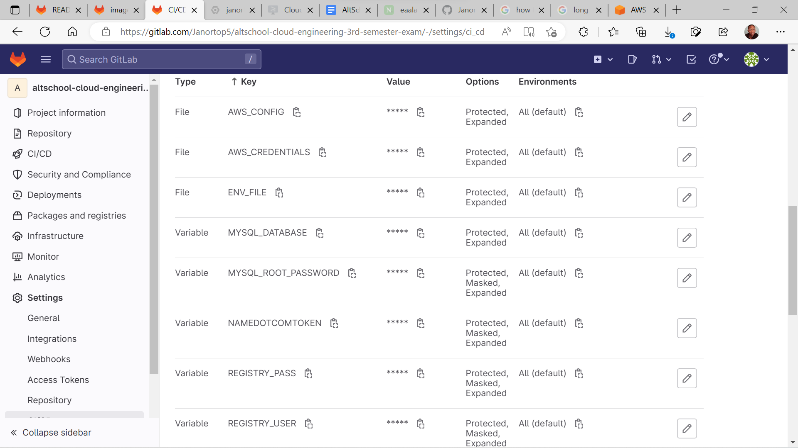
- in "./terraform/variables" put namedotcom token in var.namedotcom_token — setup of hashicorp vault in pipeline a little complex

## Breakdown
#### stage: test
- tests laravel app files before build, app uses nginx proxy, with nginx set to expose /metrics endpoint
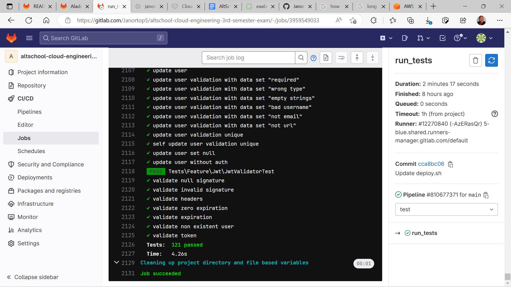
#### stage: build
- builds laravel image and pushes to dockerhub account
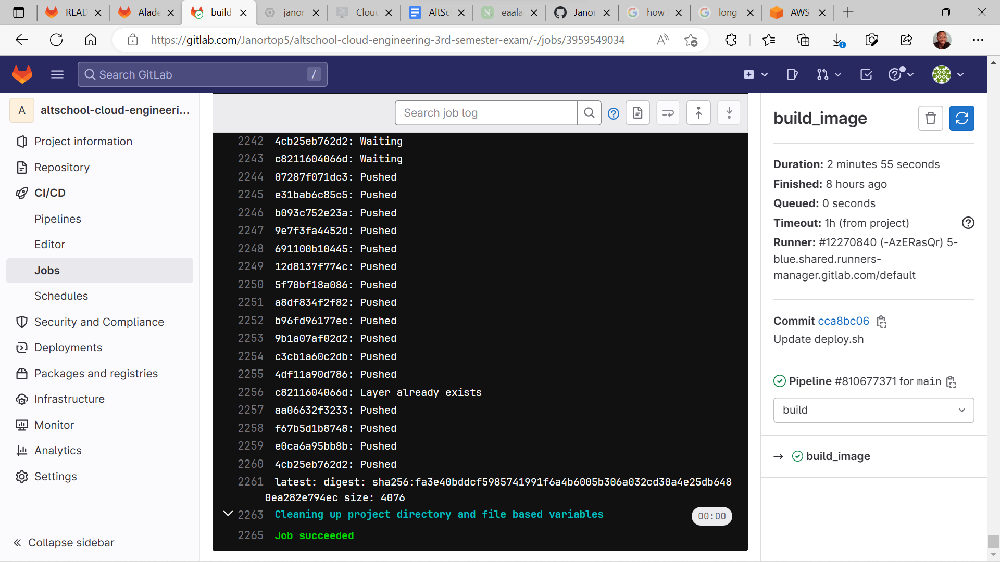
#### stage: deploy
- deploys cluster with terraform, and deploys laravel app and microservices-demo
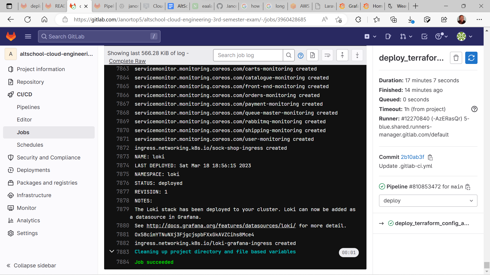
#### How pipeline works
- **stage 'test':** creates laravel app along with mysql database as service in Gitlab runner using an ubuntu image, seeds the database and runs "php artisan test"

- **stage 'build':** build docker image of laravel app from file in ./laravel-app

- **stage 'deploy':** 
```
- setup Gitlab runner with the following Binary:
  • terraform
  • aws cli 
  • aws-iam-authenticator
  • helm
- deploys terraform configuration and kubernetes manifests
```
#### ./terraform
- creates eks cluster and eks node group in private subnets with only 443 ingress rule
- sets remote backend as s3 bucket
- creates hosted zone
- creates nginx-ingress-controller and calls it's external address to attaches to a wildcard hosted zone record
- adds hosted zone nameservers to namedotcom domain using terraform namedotcom provider
#### ./deploy-laravel
- deployment of laravel app alongside an nginx exporter container for prometheus
- contains values for mysql exporter for prometheus
- service monitor for nginx exporter
- mysql secret
- laravel app ingress
- promethus-grafana ingress
- values for mysql exporter installation with helm
#### ./microservices-demo
- microservices complete deployment file
- custom made service monitors for all microservices
- front-end-ingress
- loki-ingress
#### ./lets-encrypt
- files for my let's-encrypt attempt
#### ./laravel
- laravel app files
#### ./images
- images of pipeline results and additional information
#### ./before_deploy.sh
- bash script to setup gitlab runner for deployment
- installs terraform
- installs aws-cli
- installs aws-iam-authenticator
- sets up runner to connect to cluster
#### ./deploy.sh
- deploys terraform configuration
- deploys laravel app with full monitoring
- deploys sock-shop app with full monitoring
- deploys service monitors
- deploys loki-grafana for logging
- deploys front-end-ingress
- deploys laravel-ingress
- deploys prometheus-grafana-ingress
- deploys loki-grafana-ingress
#### ./helm-commands.txt
- list of some helm commands used in pipeline
### steps to recreate
- get a namedotcom domain and create an api token
- get an aws account and create an IAM user with enough permissions preferable administratoraccess
- get a dockerhub account with the username and password as "REGISTRY_USER" and "REGISTRY_PASS"
- create a remote backend with the sample configuration file in "./terraform/remote.tf" file
- variables for the remote.tf configuration is commented out in "./terraform/variables.tf file
- import project to gitlab
- create all the variables listed above in "prerequisites for pipeline" section
- replace the domain name, and namedotcom username and token in the "./terraform/variables.tf" file
#### laravel and it's endpoint, screenshots
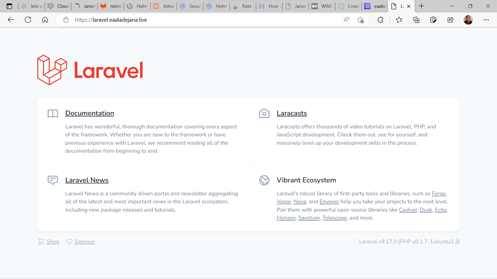
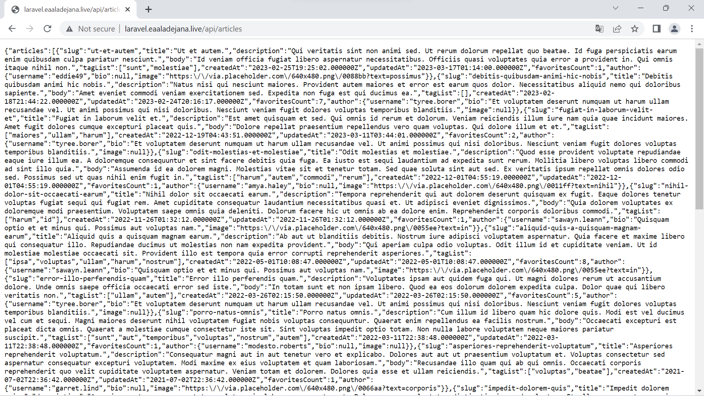
#### microservices-demo app screenshots
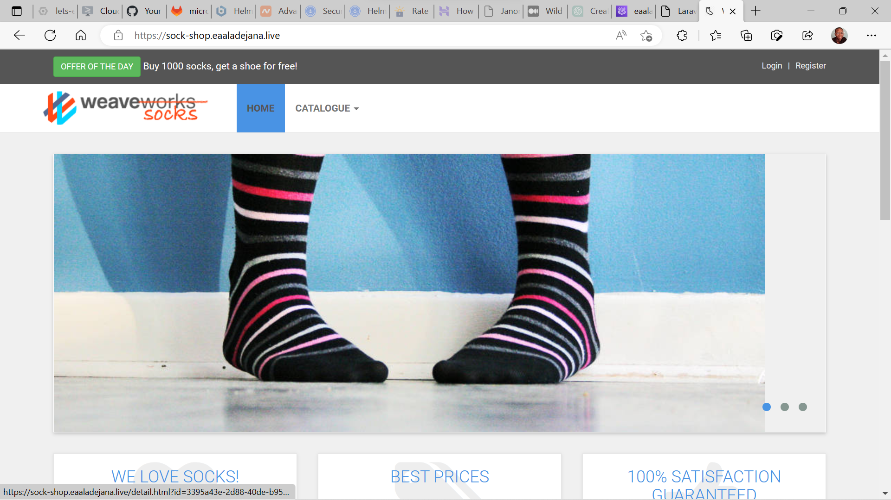
#### prometheus monitoring and metrics and service monitors
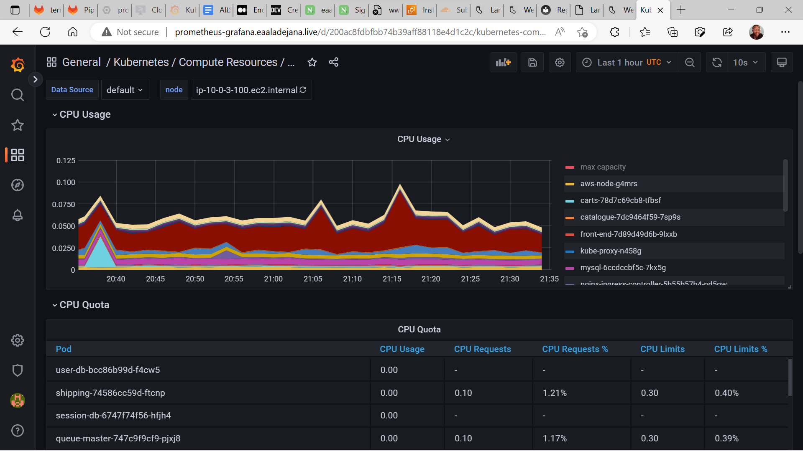
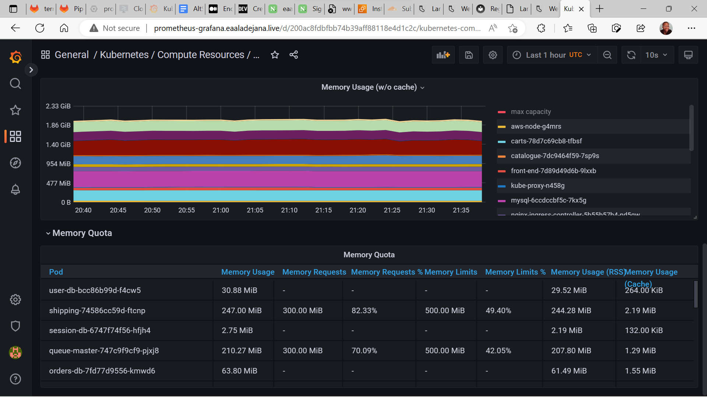
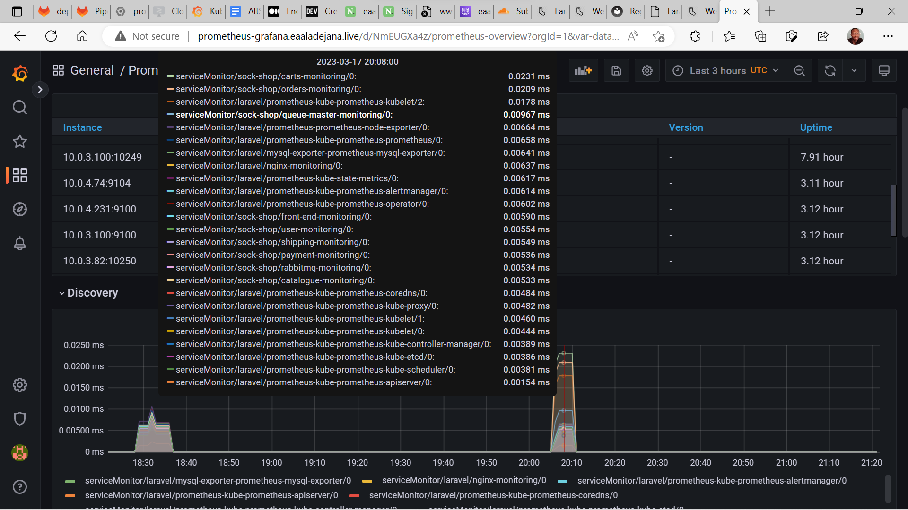
#### loki logging
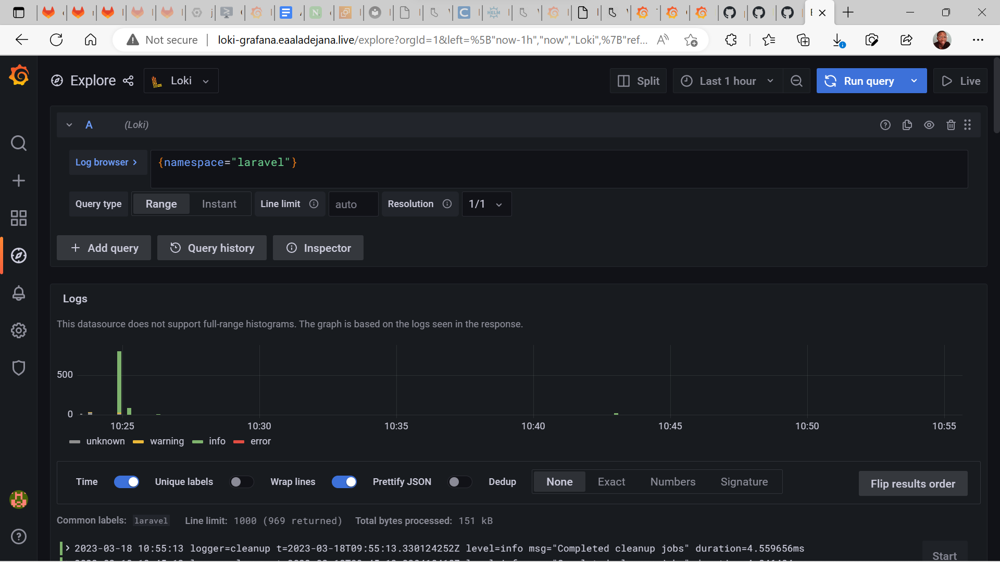
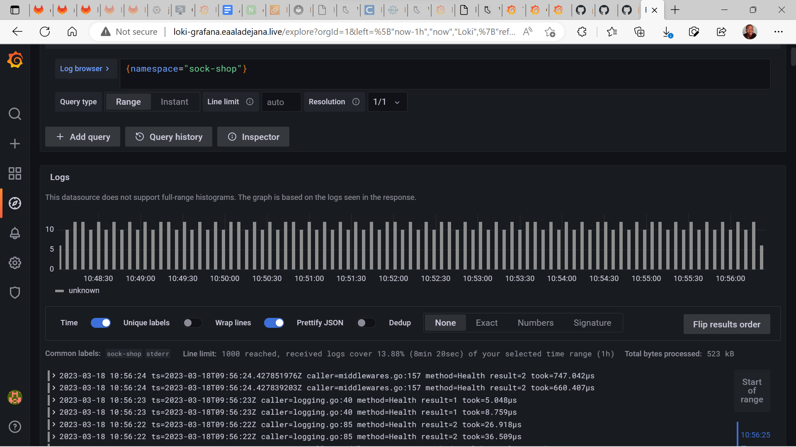
#### let's encrypt attempt
**Another time, I guess**
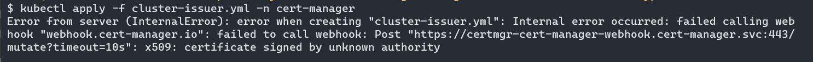
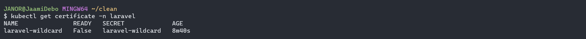
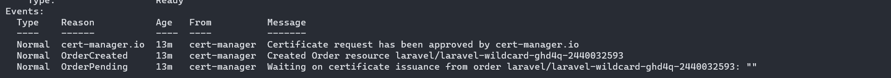
